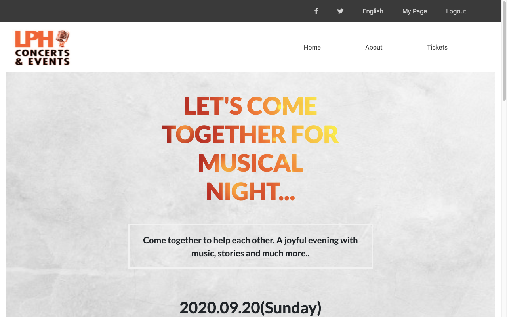

# Concerts & Events Page

> HTML & CSS capstone project: Conference Page

This project is based on an online website for Concert & Event. I customized it to a music concert with three pages, i.e homepage, about us and ticket page.

## Built With

- HTML
- CSS
- Bootstrap

## Live Demo

[Live Demo Link](https://raw.githack.com/jrai0792/concerts-page/feature-branch/index.html)

## Getting Started

To get a local copy up and running follow these simple example steps.

### Prerequisites
Install git on your local machine

### Install
Clone the repository to your local machine https://github.com/jrai0792/concerts-page

### Usage
Cd into the repository cd concerts-page

Open the index.html file and run it with any browser of your choice

## Authors

👤 **Jyoti Rai**

- GitHub: [@jrai0792](https://github.com/jrai0792)
- Twitter: [@jyotirai0792](https://twitter.com/jyotirai0792)

## 🤝 Contributing

Contributions, issues, and feature requests are welcome!

Feel free to check the [issues page](issues/).

## Show your support

Give a ⭐️ if you like this project!

## Acknowledgments

- Design idea by Cindy Shin in Behance
- Inspiration
- etc

## 📝 License

This project is [MIT](lic.url) licensed.